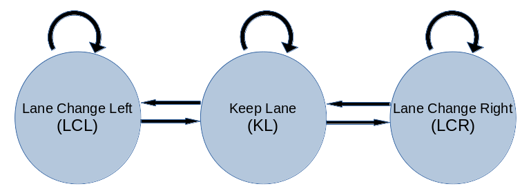

# **Highway Driving**

---

## Objectives

The goals / steps of this project are the following:
* Design a path planner that is able to create smooth, safe paths for the car to follow along a 3 lane highway with traffic
* The following events should be avoided:
  * Collision with another vehicle
  * Exceeding the maximum speed of 50 mph
  * Acceleration greater than 10 m/sq-sec
  * Jerk of 10 m/cu-s
  * Straying outside the marked lanes except while changing lanes
* Train and validate the model with a training and validation set
* Test that the model successfully drives around track (4.32 miles) without any incidents
* Summarize the solution approach with a written report

## Rubric Points
### This section will describe how the each of the [rubric points](https://review.udacity.com/#!/rubrics/1971/view) were addressed in this project.  

---

### Overview of Methodology

The solution approach uses a Finite State Machine (FSM) to model the behavior of
the car. Only three states are used:
1. Keep lane state (KL)
2. Lane Change Left (LCL)
2. Lane Change Right (LCR)

The transitions between states in the FSM are shown in the image below:

<p align="center">

</p>
<p align="center">
<em> Finite State Machine
</p>

The car starts off in the KL state. The KL state can transition to the LCL and LCR
states. The KL state can also continue in the KL state. The LCL and LCR states
can either remain in the same state or transition to the KL state.

Every time the sensor fusion measurements are made available, the vehicle
generates trajectories for all possible successor states. For each successor
state, the cost of the trajectory is evaluated based on a cost function. The
state corresponding to the trajectory with the least cost is chosen as the next
state. The trajectory corresponding to the next state is provided to the simulator.

```cpp
double min_cost = 1000000.0;
Trajectory trajectory, best_trajectory;
string best_state;
vector<std::string> states = ego.successor_states();
for(int i=0; i < states.size(); i++) {
    std::string state = states[i];
    trajectory = ego.generate_trajectory(state, sensor_fusion);
    float cost = ego.compute_cost(trajectory);
    std::cout<< state << " cost : " << cost << std::endl;
    if (cost < min_cost) {
        min_cost = cost;
        best_trajectory = trajectory;
        best_state = state;
    }
}

ego.previous_trajectory = best_trajectory;
ego.state = best_state;
next_x_vals = best_trajectory.xlocs;
next_y_vals = best_trajectory.ylocs;

msgJson["next_x"] = next_x_vals;
msgJson["next_y"] = next_y_vals;
```

The following sub-sections describe the different states.

#### Keep Lane State

In this state, the sticks to its current lane. The key task in this state is
controlling the velocity. Once the velocity is known the trajectory can be
easily determined by incrementally updating the vehicle position. For this purpose
the vehicle can be assumed to be in three "sub-states":

1. "Very close (VC)" to the vehicle ahead (corresponding to a distance less than 10 units). In this state, the vehicle velocity is decreased more drastically
and linearly proportionate to the distance from the vehicle ahead. This sub-state
is particularly important when a car from the adjacent lane abruptly changes into
ego vehicles lane at a very close distance. Rapid acceleration is critical to
avoid collision in such situations.

2. "Too close (TC)" to the vehicle ahead (corresponding to a distance between 10 and 30 units). In this state, the vehicle velocity is decreased less drastically and linearly proportionate to the distance from the vehicle ahead.

3. Far away from the vehicle ahead (corresponding to a distance greater than 30 units).
  In this state, the vehicle velocity is increased at a constant acceleration until
  the vehicle reaches a velocity of 49 mph beyond which it is keep constant.

Trajectory generation for the KL state is relatively straightforward since it does not involve lane change. This is described in more detail in the section on trajectory generation.

#### Lane Change Left and Lane Change Right States

In the LCL and LCR states, the vehicle speed is kept at the same velocity as when
it entered these states. Since logic is the same for LCL and LCR and is therefore
implemented in the same function with the target lane as one of the inputs. An important decision for LCL and LCR states is when to change lanes. The following
considerations had to be satisfied for lane change.

1. Separation from the vehicle ahead must be less than 30 units but greater than
10 units of length. This is a simplifying assumption that also makes it easier
when designing the cost function.

2. Separation from vehicles ahead should satisfy the front margin distances
(35-40 units). The front margin is kept high so that the vehicle does not enter
the "too close state" (described in an earlier section) thereby necessitating
abrupt velocity reductions in addition to lane change related jerk.

3. Separation from vehicles behind the vehicle in the target lane must satisfy the
rear margin (35 units) plus a speed buffer distance that increases when the vehicle velocity is less than the velocity of the vehicle behind it. The speed buffer
is zero when the vehicle behind is traveling at a slower speed.

The parameters used to define the front margin, rear margin and speed buffer distance are chosen conservatively to avoid failures in even in uncommon scenarios. The code
snippet that checks for safe lane change is provided below:

```cpp
double front_margin = 35.0;
double rear_margin = 35.0;

if(current_lane == 1) {
    front_margin = 40.0;
}
Vehicle vehicle_ahead, vehicle_behind;
get_nearest_vehicles(ego_s, sensor_fusion, intended_lane, vehicle_ahead, vehicle_behind);
double speed_buffer = std::max(0.0f,vehicle_behind.ref_vel - ref_vel)*(40.0/ref_vel);
if(vehicle_ahead.s - ego_s > front_margin && ego_s - vehicle_behind.s > rear_margin + speed_buffer)
    return true;
else
    return false;
```

Once it is decided that lane change is safe, the next task for the LCL and LCR
states is to create the trajectory for  the lane change. This is described in more detail in a later section.

### Compilation

#### 1. The code compiles correctly

The project submission includes the following files:
* main.cpp containing the main code
* vehicle.h contains the vehicle class description
* spline.h contains the code for the spline function used to generate trajectories
* project_report.md containing the writeup for this project

Parameters involved:
front_margin = 35 (40 if center lane)
rear_margin = 35
speed_buffer
too_close_distance = 30
very_close_distance = 10
overlap_points
waypoint distances 30, 60, 90
TRAJECTORY_POINTS = 50
max_velocity = 49
Deceleration when too_close and very_close
Acceleration when velocity < 49

too_close_to_change_lanes=10

cost for each lane


### Validation Trajectories


#### 1. The car is able to drive at least 4.32 miles without incident

The final model was able to complete 20 miles without incident.


#### 2. The car drives according to the speed limit

As noted earlier in the description for the keep lane state, there is a check
that ensures that the car accelerates only if the velocity of the car is less
than 49 mph. This ensures that the car speed does not exceed the speed limit of
50 mph.

#### 3. Max acceleration and jerk are not exceeded

The acceleration is always applied in small increments that ensure that the max
acceleration and jerk are not exceeded. There could be additional source of
acceleration due to the curvature of the track and the vehicle trajectories
during lane changes, but these are not significant  enough to exceed to
acceleration and jerk thresholds.

#### 4. Car does not have collisions

As described earlier in the earlier sections describing the keep lane and lane change states, the vehicle velocity is reduced when it comes too close to other vehicles and appropriate safety margins are maintained when
The final code was able to travel 20 miles of the track without any collisions.

#### 5. The car stays in its lane, except for the time between changing lanes

When the car is in the keep lane state, its Frenet coordiante, d, is kept
constant and this automatically ensures that the car remains in its lane. If the
car starts and ends the lane change state without transitioning back to the
keep lane state, the transition is completely quickly. One issue that could arise
is that the car could keep oscillating between the lane change and keep lane states
at a high frequency. This could lead to scenarios where the car stays outside
the lane for too long. The parameters for the lane change process were chosen
such that such a behavior does not persist. For example, by ensuring that the
front margin during lane change is greater than the distance that triggers lane
change we can prevent the car from entering the lane change state as soon as it
enters the next lane.

#### 6. The car is able to change lanes

The conditions for lane change have been described earlier and while these may
be conservative, they typically trigger lane changes several times during a single lap
around the track.

### Reflection on how to generate paths

As noted earlier, paths can be generated in the keep lane (KL) state and the
lane change (LCL and LCR) states. It involves two components, the shape of the
curve and the spacing of points in the curve. To ensure continuity with  the
previous trajectory, a fixed number of points from the previous trajectory
(known as overlap_points) is added to the current trajectory. In the current
project, the number of points from the

A trajectory shape is generated by using a cubic spline. To maintain  continuity
with the previous trajectory, the last two way points from the previous
trajectory  are added to the list of spline points. Three further way points are
added to the spline points list. These points are some distance away (s=40, 70
and 100  units of length) in the intended final lane of the trajectory. The
aforementioned three points ensure that the shape of the trajectory ends as a
straight line in the intended target lane of the trajectory. The spline function
is generated using the above five points and is used to define the shape of the
trajectory. Once the shape is defined by the spline function, the trajectory can
be created by adding points along the shape. The spacing of the points is
determined by the local velocity. For the lane change trajectory, the velocity
is constant. For the keep lane trajectory, the spacing is affected by accelerations
and decelerations in velocity depending on the distance of the vehicle from the
vehicle immediately ahead of it.

### Video of Final Result
